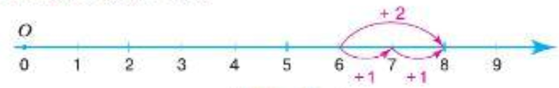
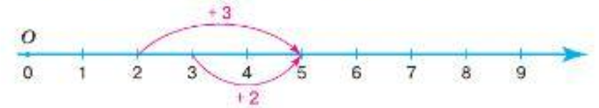
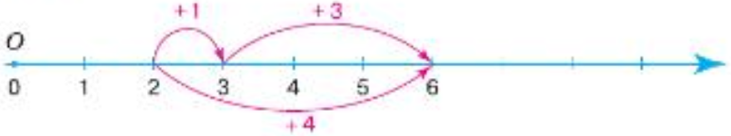
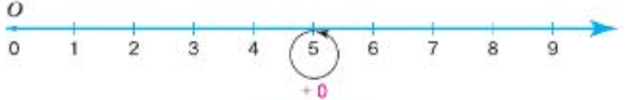
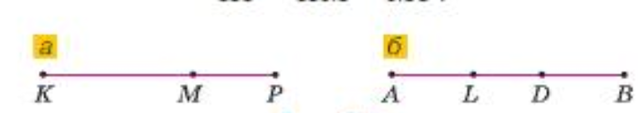

2.1 [Действие сложения. Свойство сложения](#21-действие-сложения-свойства-сложения)\
2.2 \
2.3 \
2.4 \

## 2.2

## 2.1 Действие сложения. Свойства сложения

Прибавив к натуральному числу единицу, мы получим следующее за ним число. Например: 8 + 1 = 9; 999 + 1 = 1000.\
Чтобы сложить числа 6 и 2, нужно к числу 6 прибавить два раза единиц: 6 + 2 = 6 + 1 + 1 = 7 + 1 = 8.\
Число, которое получают в результате сложения чисел, называют __суммой__. Числа, которые складывают, называют __слагаемыми__.\
\
Действие сложения чисел можно показывать на координатной прямой.\
На координатной прямой удобно иллюстрировать __свойства сложения__.\
\
1. __Переместительное свойство__. Сумма чисел не меняется при перестановке слагаемых: 3 + 2 = 5 и 2 + 3 = 5

2. __Сочетательное свойство__. Чтобы к числу прибавить сумму двух чисел, можно сначала прибавить первое слагаемое, а потом к полученной сумме - второе слагаемое.\
Например: 
- 2 + (1 + 3) = 2 + 4 = 6
- (2 + 1) + 3 = 3 + 3 = 6

1. Число не меняется при сложении с нулем.\
Например: 5 + 0 = 5. По переместительному свойству сложения имеем 5 + 0 = 0 + 5.\
Сумму нескольких слагаемых можно записать без скобок:
- (4 + 9) + 8 = 4 + 9 + 8 = 21

Точка М лежит на отрезке КР, поэтому длина отрезка КР равна сумме длин его частей КМ и МР: КР = КМ + МР.\
Длину отрезка АВ можно записать различными способами: \
AB = AL + LD + DB = AL + LB = AD + DB.

