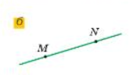
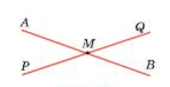
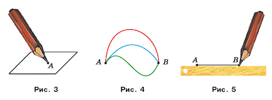
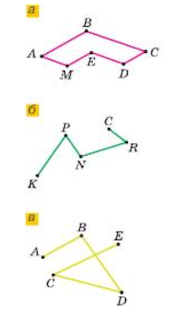
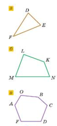
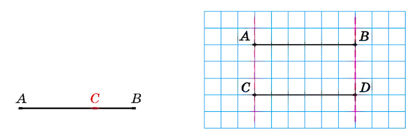
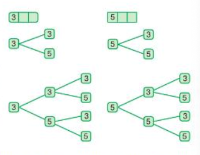

1.4 [Отрезок и его длина. Ломанная. Многоугольник](#13-отрезок-и-его-длина-ломаная-многоугольник\)\
1.4 [Плоскость, прямая, луч, угол](#14-плоскость-прямая-луч-угол)\
1.5 \
1.6 \
1.7 \

## 1.5

## 1.4 Плоскость, прямая, луч, угол

Плоскость представляют ровной, без толщины, неограниченно продолжающейся во во всех направлениях.\
Плоскость не имеет границ.\
Представление о плоскости дают поверхности пола, экрана компьютера. У этих поверхностей есть края(границы).\
Плоскость бесконечна, поэтому ее нельзя изобразить. Эту геометрическую фигуру можно лишь вообразить.

\
На плоскости можно начертить отрезок. Любой отрезок с помощью линейки можно продлить в обе стороны. Мысленно это можно сделать неограниченно, и тогда мы получим геометрическую фигуру, которую называют прямой.\
Прямая не имеет концов. Она бесконечна. Поэтому на рисунке мы может изобразить только часть прямой - отрезок.\
__Через две точки проходит только одна прямая__\
Если попытаться провести через эти точки еще одну прямую, то нам это не удастся.\
Это свойство позволят обозначить прямую, называя две любые ее точки. Читают "прямая АВ" или "прямая ВА".\
Прямые также обозначаются одной строчной латинской буквой.\

## 1.3 Отрезок и его длина. Ломаная. Многоугольник

Отметим на бумаге две точки А и В. \
Эти точки можно соединить различными линиями.\
Если соединить эти две точки линией с помощью линейки то получим линию называемую отрезком, а точки А и В - концами отрезка.

Точка и отрезок - примеры геометрических фигур.\
Существует единственный отрезок, концами которого являются точки А и В.\
Поэтому отрезок обозначают, записывая точки, являющиеся его концами: "отрезок АВ" или "отрезок ВА".

Измерить отрезок - это значит подсчитать, сколько единичных отрезков в него помещается.\
Обычно длина единичного отрезка равна 1 см.\
Для измерения отрезков можно выбрать и другие единицы длины, например, 1 мм, 1 дм, 1 км.
- Десять сантиметров называют дециметром: 10 см = 1 дм;
- Сто сантиметров называют метром: 100 см = 1 м;
- Один сантиметр равен десяти миллиметрам: 1 см = 10 мм;
- Один километр равен одной тысячи метров: 1 км = 1000 м.

Длину отрезка АВ также называют расстоянием между точками А и В.

\
На рисунке линии составлены из отрезков, при этом соседние отрезки не лежать на одной прямой. Такую линию называют ломанной. Отрезки, из которых состоит ломанная, называют звеньями ломанной, а их концы - вершинами.\
Считают, что отрезки образуют ломаную, если конец первого отрезка совпадает с концом второго, а другой конец второго отрезка - с концом третьего и т.д.\
Ломанные бывают замкнутыми(а), незамкнутыми(б, в).\
Длина ломаной равна сумме длин ее звеньев.
Точки K, C и A, E - концы ломаной.

\
На рисунке замкнутая ломанная FED составлена из трех отрезков FE, ED, DF. Такую фигуру называют треугольником. Отрезки называют сторонами треугольника, а точки F, E, D - ее вершинами.

Четырехугольник имеет четыре стороны и четыре вершины, шестиугольник - шесть сторон и шесть вершин. Это примеры многоугольников.

Многоугольник образован замкнутой ломаной, звенья которой не пересекаются.\
Периметром многоугольника называют сумму длин сторон многоугольника и обозначают P.

Числительные, стоящие в левой части равенства, читаются в И.п., а в правой части читаются в дательном падеже.\
1 см = 10 мм - один сантиметр(И.п.) равен десяти миллиметрам (Д.п.)\
23 км = 2 300 000 см - двадцать три (И.п.) километра равны двум миллионам тремстам тысячам сантиметров.

\
Длина отрезка обладает следующими свойствами\
Если на отрезке АВ отметить точку С, то длина отрезка АВ равна сумме длин отрезков АС и СВ. Пишут: АВ = АС + СВ

На втором рисунке два отрезка АВ и CD при наложении совместятся.\
Два отрезка называются равными, если они совмещаются при наложении.\
Следовательно, отрезки АВ и CD равны. Пишут AB = CD.\
Равные отрезки имеют равные длины.\
Из двух неравных отрезков большим будем считать тот, длина которого больше.

## 1.1 Таблицы

Столбцы отсчитывают слева направо.\
Строки - сверху вниз.\
В ячейках записывают нужную информацию.\
Обычно в 1-ом столбце или строке записывают название рассматриваемых объектов.\
Такие столбцы и строки называют **заглавными**.

Таблица - удобная форма представления информации по однотипным столбцам и строкам.

Таблица которая хранит и наглядно представляет данные называется информационной, ее задача - удобно показывать информацию а не считать\
Например: расписание уроков, классный журнал, расписание движения транспорта, календарь

Таблица в которой делаются различные вычисления, куда включается строка или столбец "Итого"(Всего) для получения суммы, называется вычислительной.

Таблица в которой фиксируют сколько раз встречается тот или иной объект или явление называется таблицей подсчета.\
Вместо того чтобы каждый раз писать число, мы ставим отметку:\
/ = 1 раз\
//// = 4 раза\
///// = 5 раз\
То есть сначала мы отмечаем каждое появление объекта, а затем подсчитываем количество отметок.

## 1.2 Цифры и числа

Числа 1, 2, 3, ... используемые при счете предметов, называют натуральными.\
Не все числа, которыми мы пользуемся - натуральные.\
Так числа: 0, 1/2 - натуральными не являются.\
Все числа записанные в порядке возрастания или в по порядку счета, образуют ряд натуральных чисел, или натуральный ряд.\
Первым числом натурального ряда является число 1, вторым 2, третьим 3 и тд\
В натуральном ряду за каждым числом следует еще одно число, которое больше предыдущего на единицу. Поэтому в натуральном ряду нет последнего числа. Число 1 не имеет предыдущего. Следовательно, среди натуральных числе есть наименьшее число - это число 1, но нет наибольшего.\
Записывают натуральные числа с помощью десяти цифр: 0, 1, 2, 3, 4, 5, 6, 7, 8, 9.\
Способ записи чисел называют нумерацией или системой счисления.\
Цифра - единичный символ, графический знак. В десятичной системе их всего десять: 0, 1, 2, 3, 4, 5, 6, 7, 8, 9. Цифры подобны буквам алфавита. Сами по себе они лишь обозначают малые величины от нуля до девяти.\
Число - абстрактная величина, состоящая из одной или нескольких цифр. Могут быть сколько угодно большими. Выражают количество, порядок и код.\
Цифра vs число: цифр ограниченное количество (у нас десять), а чисел бесконечно много. Из десяти цифр можно составить любое число во Вселенной.\
Система счисления(нумерация) - это набор правил и символов, которые определяют как именно из цифр складываются числа, как грамматика и алфавит языка.\
В системе счисление важно основание показывающее:
1. Сколько разных цифр используется в алфавите системы
2. Какому значению соответствует каждый разряд (позиция цифры)

Если при этом важно, на каком месте(позиции) стоит цифра, то такую систему счисления называют позиционной.\
Место на котором стоит цифра в записи числа, называется разрядом.\
На первом месте справа записывают единицы, на втором - десятки, на третьем - сотни и тд
Например, число 3703 состоит из четырех разрядов: 3 тысячи, 7 сотен, 0 десятков, 3 единицы.\
Десять единиц составляют десяток, десять десятков - сотню, десять сотен - тысячу и т.д., т.е. единица каждого следующего разряда в 10 раз больше единицы предыдущего разряда. Такую систему счисления называют десятичной, запись чисел в ней - десятичной записью чисел.\
Наша система счисления десятичная и позиционная.

В десятичной записи числа отсчет разрядов начинается справа, с разряда единиц - это самый младший разряд.
- позиция справа - это 10^0 = 1, то есть единицы
- следующая влево - 10^1 = 10, то есть десятки
- потом 10^2 = 100 - сотни и так далее.

Получается что нумерация разрядов идет: 1-й разряд - единицы, 2-й - десятки, 3-й - сотни и тд. А если использовать степени десятки - то счет начинается с нуля: разряд единиц - это 0-й разряд, десятков - 1-й

Отсутствие единиц разряда в десятичной записи числа обозначает цифра 0.\
Цифра 0 служит для обозначения числа "нуль". Это число означает отсутствие предметов для счета, т.е ни одного.\
Нуль не считают натуральным числом.

Число из двух знаков называется двузначным, из трех - трехзначным и т.д.\
Например,\
числа 1, 2, 3, - однозначные\
число 71234 - пятизначное и т.д.\
Двузначные, пятизначные и т.д. числа называются многозначными.

При чтении многозначных чисел их разбивают справа налево на классы(группы), по три цифры в каждом (самая левая группа может состоять из трех, из двух или из одной цифры). Первый справа класс называется классом единиц, второй - классом тысяч, затем идут классы миллионов, миллиардов и т.д.

Миллион - это 1000 тысяч, его записывают как 1 млн или 1 000 000.
Миллиард - это 1000 миллионов. Его записывают 1 млрд или 1000 000 000.

Число 27 000 297 367 имеет 367 единиц в классе единиц, 297 единиц в классе тысяч, 0 единиц в классе миллионов и 27 единиц в классе миллиардов.

| Класс | Миллиарды | | | Миллионы | | | Тысячи | | | Единицы | | |
| :--- | :---: | :---: | :---: | :---: | :---: | :---: | :---: | :---: | :---: | :---: | :---: | :---: |
| **Разряд** | сотни миллиардов | десятки миллиардов | единицы миллиардов | сотни миллионов | десятки миллионов | единицы миллионов | сотни тысяч | десятки тысяч | единицы тысяч | сотни | десятки | единицы |
| **Число** | 1 | 0 | 0 | 0 | 1 | 0 | 0 | 0 | 3 | 0 | 0 | 0 |

Правило чтения натуральных чисел. 
- разбить число на классы
- чтение числа начать слева, называя по очереди число единиц каждого класса и добавляя название класса
- название класса, в котором все три цифры - нули, не произносить и название класса единиц тоже не произносить

Правописание сокращений слов: тыс., млн, млрд. Только тыс. пишется с точкой.

Задача 1.2.1\
Запиши все трехзначные числа с помощью цифр 3 и 5.\
 Сколько получилось чисел?

Решение.\
В записи числа в разряде сотен может стоять цифра 3 или 5.\
В разряде десятков в каждом случае также может стоять одна из двух цифр - 3 или 5.\
В разряде единиц также в каждом случае можно записать 3 или 5.\
Получили восемь чисел 333, 335, 353, 355, 533, 535, 553, 555.\
При решении этой задачи для подсчета вариантов использовалась схемы, которые называются "Деревом всех вариантов"